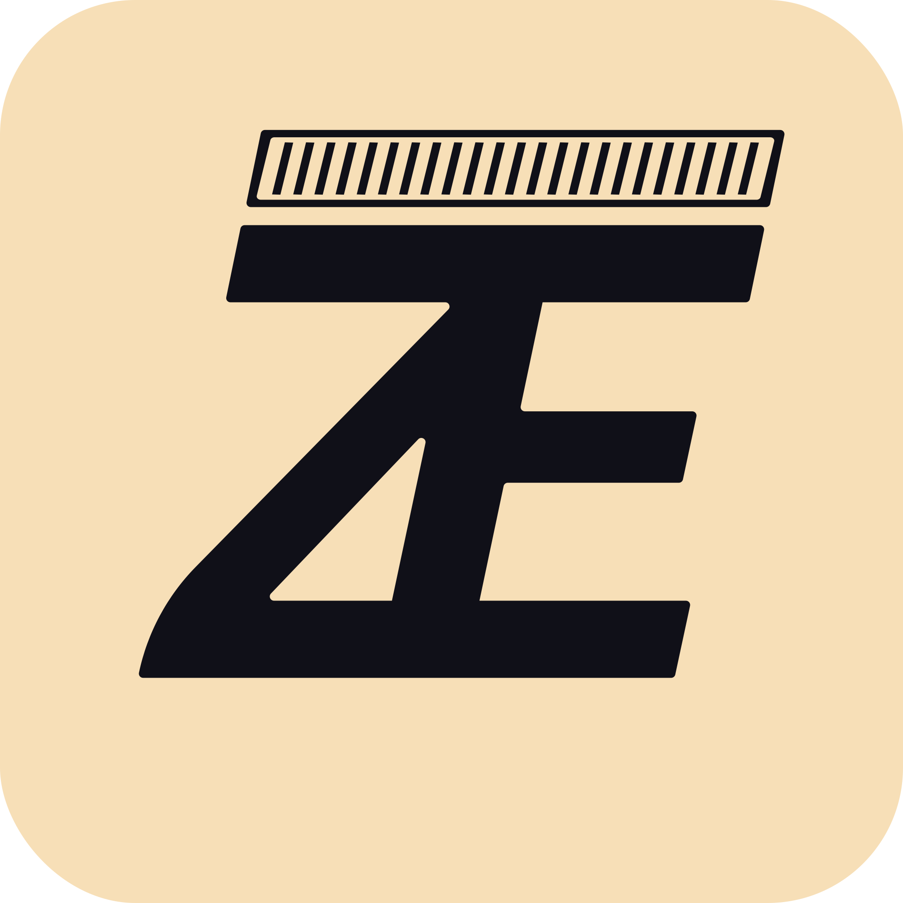

# Zeta Paste

This open source web-app is designed to encrypt text (or "secret message"). It encrypts text using end-to-end (E2E) encryption so that only you or someone you trust who knows the password can read it.

Encryption and decryption works on your device. The app runs fully on the client side and can be used offline. Your data is not transferred anywhere or stored anywhere.

After encryption you get three self-contained parts:

- SALT
- IV (Initialization Vector)
- DATA

These parts are necessary for decryption and are not stored in the app or on servers. For successful decryption, you will need this parts, password and iterations count that was used for encryption.

For additional information, please read **[this](https://zeta.su/paste/about/)**.
